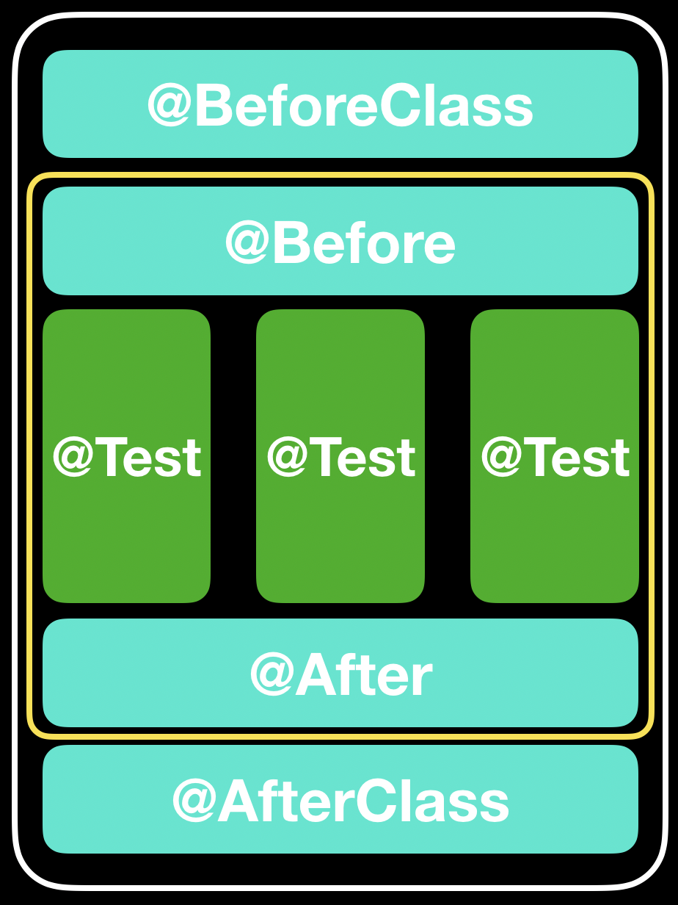

# JUnit 테스트 생명주기

먼저 JUnit에 대한 설명을 하고 시작하겠다. <u>JUnit은 자바에서 동작하는 수많은 테스트 라이브러리 중 하나</u>이다. 이름을 봐서는 유닛(모듈 혹은 단위) 테스트 전용일 것 같지만 실제로는 <u>통합 테스트, 시스템 테스트, UI 테스트 등 모든 수준의 테스트를 만들 수 있다.</u> 이번 챕터에서는 사용 방법을 중점적으로 설명하므로 *테스트 코드의 필요성 등은 생략*하도록 하겠다.

> 책에서는 JUnit4를 기준으로 설명한다. 그러나 현재 JUnit5 버전의 등장으로 기존의 용법과 크게 달라진 상황이다. 따라서 가능한 한 JUnit4와 JUnit5를 병렬적으로 표시하겠지만 기본적으로 JUnit4가 기준으로 설명을 할 것이다.

### Q. JUnit 테스트를 실행할 때, 어떤 일이 일어나는가?

JUnit의 생명주기를 알면 JUnit의 동작원리를 알 수 있다. 먼저 자주 사용되는 어노테이션을 살펴보고 설명하겠다. 아래 나오는 어노테이션은 JUnit을 사용하기 위한 필수지식이라고 생각하면 좋다.

- @BeforeClass(@BeforeAll) : 전체 테스트 시작 전에 딱 한번 호출되는 메서드
- @Before(@BeforeEach) : 테스트를 진행하기 전에 동작할 메서드에 사용
- @Test : 테스트를 진행할 메서드에 사용
- @After(@AfterEach) : 테스트를 진행한 후에 동작할 메서드에 사용
- @AfterClass(@AfterAll) : 전체 테스트 종료 후에 딱 한번 호출되는 메서드

괄호는 JUnit5의 문법을 나타내므로 참고하길 바란다. 가장 중요한 어노테이션은 @Test 이다. 각 @Test 별로 테스트가 동작하고, 어떤 테스트를 하는지 한눈에 확인 할 수 있다.

만약 테스트 전에 필수로 실행해야 할 프로세스가 있다면 @Before를, 테스트 후에 해야할 업무가 있다면 @After를 사용하면 된다.

