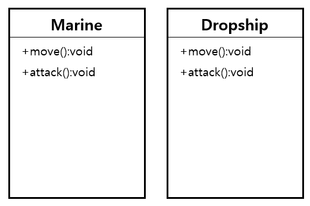
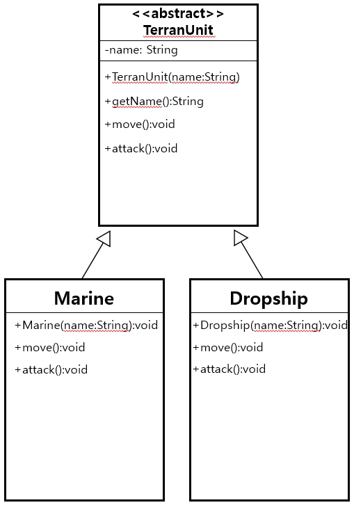
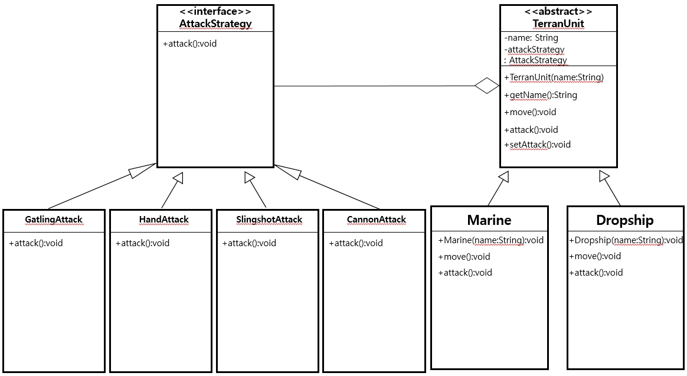

# 예제 패턴 살펴보기
>디자인패턴 자체를 코드 없이 설명하기에는 탁상공론으로 생각되어, 할 수 없이 많은 코드를 넣게 되는 것을 미리 양해 드립니다.

이번 파트에서 설명할 디자인 패턴은 [Builder Pattern(빌더패턴)](#q-빌더-패턴은-얼마나-유용한가)
, [Strategy Pattern(스트레티지 패턴)](#q-스트레티지-패턴의-예를-보여줄-수-있는가)
, [Template Method Pattern(템플릿 메서드 패턴)](#q-템플릿-메서드-패턴은-어떻게-사용하는가)
이상 세 가지 이다. 각 패턴을 어떻게 구현하는지는 물론, 어떤 상황에서, 어떤 문제를 해결할 수 있는지를 중점적으로 살펴보겠다.

### Q. 빌더 패턴은 얼마나 유용한가?
조금 더 현실감 있게 질문을 바꾸자면 **'빌더 패턴은 무엇이고 언제 사용하나?'** 가 직관적인 형태이다.

우선 문제상황을 가정해서 빌더패턴이 어떤 문제를 어떻게 해결할 수 있는지 보자.(책에서는 수의사를 예를 들지만, 개발자의 흔한 예제인 Emplyee를 들겠다.)
>직원 객체는 이름, 나이, 성별, 부서, 연봉 등의 필수정보로 갖고 있으며, 결혼유무, 취미 등의 선택정보를 갖는다. 객체를 생성해보자.
```java
public class Emp {
    private String name;
    private int age;
    private String gender;
    private String dept;
    private long salary;

    private boolean maritalStatus;
    private String hobby;

    // 생성자
    public Emp(String name, int age, String gender, String dept, long salary, boolean maritalStatus, String hobby) {
        this.name = name;
        this.age = age;
        this.gender = gender;
        this.dept = dept;
        this.salary = salary;
        this.maritalStatus = maritalStatus;
        this.hobby = hobby;
    }
}
```
위 객체를 생성해 사용해야한다면, 파라미터의 값을 위치에 의존하여 전달 할 수 밖에 없다.(물론 IDE가 파라미터마다 어떤 파라미터를 전달하라고 알려주지만 말이다.) 100개가 넘는 필드를 생성자로 세팅하려고 하면 모니터에 검지손가락을 올려놓고 몇번째 객체인지 열심히 세어보던 경험이 있을 것이다. 빌더패턴은 생성자가 갖는 이런 문제를 Setter를 통해 극복하려고 한다. 아래 코드는 위 코드에 빌더패턴을 적용시켰다.
```java
public class Emp {
    // 내부 static class인 Builder 객체를 통해 객체 생성
    public static class Builder {
        private String name;
        private int age;
        private String gender;
        private String dept;
        private long salary;

        private boolean maritalStatus;
        private String hobby;

        public Builder setName(String name) {
            this.name = name;
            return this;
        }

        public Builder setAge(int age) {
            this.age = age;
            return this;
        }

        public Builder setGender(String gender) {
            this.gender = gender;
            return this;
        }

        public Builder setDept(String dept) {
            this.dept = dept;
            return this;
        }

        public Builder setSalary(long salary) {
            this.salary = salary;
            return this;
        }

        public Builder setMaritalStatus(boolean maritalStatus) {
            this.maritalStatus = maritalStatus;
            return this;
        }

        public Builder setHobby(String hobby) {
            this.hobby = hobby;
            return this;
        }
        public Emp build() {
            // 필수값 체크
            if (Optional.ofNullable(this.name).isEmpty()
                    || Optional.ofNullable(this.age).isEmpty()
                    || Optional.ofNullable(this.gender).isEmpty()
                    || Optional.ofNullable(this.dept).isEmpty()
                    || Optional.ofNullable(this.salary).isEmpty()) {
                throw new IllegalStateException("필수값이 부족합니다.");
            }

            // EMP 객체를 리턴
            return new Emp(this.name, this.age, this.gender, this.dept, this.salary, this.maritalStatus, this.hobby);
        }
    }

    private final String name;
    private final int age;
    private final String gender;
    private final String dept;
    private final long salary;

    private final boolean maritalStatus;
    private final String hobby;

    // 생성자
    private Emp(final String name, final int age, final String gender, final String dept, final long salary, final boolean maritalStatus, final String hobby) {
        this.name = name;
        this.age = age;
        this.gender = gender;
        this.dept = dept;
        this.salary = salary;
        this.maritalStatus = maritalStatus;
        this.hobby = hobby;
    }

    // 객체 데이터 확인
    @Override
    public String toString() {
        return "Emp{" +
                "name='" + name + '\'' +
                ", age=" + age +
                ", gender='" + gender + '\'' +
                ", dept='" + dept + '\'' +
                ", salary=" + salary +
                ", maritalStatus=" + maritalStatus +
                ", hobby='" + hobby + '\'' +
                '}';
    }
}
```
'단순해 보이던 객체를 더 복잡하게 만들었잔아?! 좋은거 맞아?' 라고 생각이 들 수 있다. 그럼 이번엔 호출하는 부분을 보자. 

```java
// 생성자를 이용한 방식
Emp constructor = new Emp("bbubbush", 31, "M", "Developer", 100_000L);

// 빌더패턴을 이용한 방식
Emp builder = new Emp.Builder()
        .setName("bbubbush")
        .setAge(31)
        .setGender("M")
        .setDept("Developer")
        .setSalary(100_000L)
        .build();
```
빌더패턴의 우월성을 나타내고자 함이 아니니 위 코드를 보고 빌드패턴을 썻을 때와 생성자를 호출할 때의 차이점을 명확히 설명할 수 있다면 학습목표를 충분히 달성한 것이다.


#### 빌드 패턴 정리

**[등장배경]**

객체의 생성자는 파라미터 순서에 의존하여 데이터를 전달하므로, 배경지식 없이 마주하면 어떤 데이터를 넣는지 명확하지 않다. 따라서 필드값을 파라미터 순서에 독립적으로 관리하면서, 협업시에 명시적으로 데이터를 표시하기 위해 등장하였다.

**[장점]**
- 객체 생성 시 세팅하고자 하는 데이터를 명확히 할 수 있다.(많은 필드값에서 발생하는 혼란을 줄일 수 있다.)
- 생성자 호출 시, 파라미터의 순서에 제약을 받지 않는다.

**[단점]**
- 구현이 기존 방법에 비해 복잡 하다.
- 해당 객체가 빌드패턴으로 구현되어 있는지, 생성자를 통해 구현되고 있는지 알 수 없어 명확한 규칙이 필요하다.
- 협업에 러닝 커브가 발생 한다.

**[구현방법]**
1. 객체의 내부에 staic inner class인 Builder 클래스를 선언한다.
2. Builder 클래스 내 필드에 대한 Setter를 설정하고 return 타입을 Builder로 하여 자기 자신을 리턴한다.(return this;)
3. Builder 클래스 내 build() 메서드를 만들어 객체의 private 생성자를 리턴하도록 설정한다.

### Q. 스트레티지 패턴의 예를 보여줄 수 있는가?
자바개발자가 가장 흔하게 접하는 패턴으로 생각된다. 흔히 Dependency Injection(의존성 주입)으로 잘 알려져 있으며, 핵심 영역을 상황에 따라 바꿔 끼우면서 활용할 수 있다. 빌드패턴과 마찬가지로 어떤 상황에서 어떤 문제가 발생하여 등장하게 되었는지를 중심으로 설명하겠다. 고객의 요구사항을 스트레티지 패턴을 적용시켜 보자.
>고객은 스타크래프트를 카피하여 캐릭터를 만들고 싶어하는 게임회사이다. 본 계약 체결에 앞서 프로토타입을 보고자하는 고객을 위해 걸어서 움직이고 공격시에는 총을 쏘는 마린, 공중을 날라다니며 공격은 할 수 없는 드랍쉽 등 두 캐릭터를 만들고자 한다. 


```java
/*1차 프로토타입*/
// 마린
class Marine {
    public void move() {
        System.out.println("걸어서 움직입니다.");
    }

    public void attack() {
        System.out.println("총으로 공격합니다.");
    }
}
// 드랍쉽
class Dropship {
    public void move() {
        System.out.println("하늘을 날아서 움직입니다.");
    }

    public void attack() {
        System.out.println("공격을 할 수 없습니다.");
    }
}
```
>1차 프로토타입을 여유있게 만들고 쉬고 있던 발표 당일, 갑작스럽게 고객이 전화가 걸려와 '사장님이 드랍십이 미사일 공격하는 것을 원한다'고 전달한다. 바꾸는 것은 어렵지 않지만 앞으로도 이런식으로 요구사항이 바뀐다면 일정에 차질이 생길 것 같아 스트레티지 패턴을 적용하고자 한다.


```java
/*2차 프로토타입 - 드랍쉽이 미사일 공격*/
public class Main {
    public static void main(String[] args) {
        TerranUnit marine = new Marine("marine1");
        marine.attack();
        marine.move();

        TerranUnit dropship = new Dropship("dropship1");
        dropship.attack();
        dropship.move();

    }
}

// 추상클래스
abstract class TerranUnit {
    private String name;

    public TerranUnit(String name) {
        this.name = name;
    }

    public String getName() {
        return name;
    }

    abstract void move();
    abstract void attack();
}

// 마린
class Marine extends TerranUnit {
    public Marine(String name) {
        super(name);
    }

    @Override
    public void move() {
        System.out.println(super.getName() + " :: 걸어서 움직입니다.");
    }
    @Override
    public void attack() {
        System.out.println(super.getName() + " :: 총으로 공격합니다.");
    }
}

// 드랍쉽
class Dropship extends TerranUnit {
    public Dropship(String name) {
        super(name);
    }

    @Override
    public void move() {
        System.out.println(super.getName() + " :: 하늘을 날아서 움직입니다.");
    }
    @Override
    public void attack() {
        System.out.println(super.getName() + " :: 미사일 공격을 합니다.");
    }
}
```
>1차 프로토타입 발표 후, 고객사 사장님의 만족스러운 반응을 기대했으나 미간이 찌푸려져 있는 것으로 보니 뭔가가 맘에 안드는 눈치이다. 티타임을 가지면서 이야기 해보니 이번에는 마린의 무기를 기존의 기관총에 더해 맨손, 대포, 새총 등 랜덤하게 들면 좋겠다는 것이다. 걱정이다. 각 무기를 다르게 가진 객체를 만들자니 업무가 너무 늘어나고, 요구사항의 변화에도 민첩하게 대응할 수 없기 때문이다.

"따라서 공격방법마저 스트레티지 패턴을 적용시켜 더이상 객체는 손대지않고, 호출하는 영역에서 상태를 결정하도록 하기로 했다."


```java
/*3차 프로토타입 - 마린의 다양한 공격*/
public class Main {
    public static void main(String[] args) {
        TerranUnit marine1 = new Marine("marine1");
        marine1.move();
        // 맨손 공격
        marine1.setAttackStrategy(ATTACK_TYPE.Hand.getAttackStrategy());
        marine1.attack();
        // 게틀링 공격
        marine1.setAttackStrategy(ATTACK_TYPE.Gatling.getAttackStrategy());
        marine1.attack();
        // 새총 공격
        marine1.setAttackStrategy(ATTACK_TYPE.Slingshot.getAttackStrategy());
        marine1.attack();
        // 캐논 공격
        marine1.setAttackStrategy(ATTACK_TYPE.Cannon.getAttackStrategy());
        marine1.attack();
    }
}
// 유닛 추상클래스
abstract class TerranUnit {
    private String name;
    private AttackStrategy attackStrategy;

    public TerranUnit(String name) {
        this.name = name;
        this.attackStrategy = new GatlingAttack();// 기본값
    }

    public String getName() {
        return name;
    }

    abstract void move();
    public void attack() {
        this.attackStrategy.attack();
    }

    public void setAttackStrategy(AttackStrategy attackStrategy) {
        this.attackStrategy = attackStrategy;
    }
}

// 마린
class Marine extends TerranUnit {
    public Marine(String name) {
        super(name);
    }

    @Override
    public void move() {
        System.out.println(super.getName() + " :: 걸어서 움직입니다.");
    }
}

// 드랍쉽
class Dropship extends TerranUnit {
    public Dropship(String name) {
        super(name);
    }

    @Override
    public void move() {
        System.out.println(super.getName() + " :: 하늘을 날아서 움직입니다.");
    }
}

// 공격방법 인터페이스
interface AttackStrategy {
    void attack();
}

// 기관총공격
class GatlingAttack implements AttackStrategy {
    @Override
    public void attack() {
        System.out.println("기관총으로 드르르~ 공격합니다.");
    }
}

// 맨손공격
class HandAttack implements AttackStrategy {
    @Override
    public void attack() {
        System.out.println("맨손으로 퍽퍽 공격합니다.");
    }
}

// 새총공격
class SlingshotAttack implements AttackStrategy {
    @Override
    public void attack() {
        System.out.println("새총으로 틱틱 공격합니다.");
    }
}

// 대포공격
class CannonAttack implements AttackStrategy {
    @Override
    public void attack() {
        System.out.println("대포로 퍼엉~ 공격합니다.");
    }
}

// 공격방법을 ENUM으로 정하여 호출
enum ATTACK_TYPE {
    Gatling(new GatlingAttack())
    , Hand(new HandAttack())
    , Slingshot(new SlingshotAttack())
    , Cannon(new CannonAttack());

    private AttackStrategy attackStrategy;
    private ATTACK_TYPE(AttackStrategy attackStrategy) {
        this.attackStrategy = attackStrategy;
    }

    public AttackStrategy getAttackStrategy() {
        return attackStrategy;
    }

    public void setAttackStrategy(AttackStrategy attackStrategy) {
        this.attackStrategy = attackStrategy;
    }
}
```
드디어 끝이났다! 이제는 어떤 새로운 무기를 요구해도 AttackStrategy 인터페이스를 구현하는 새로운 구현체를 만들고, 마린을 생성하는 시점에 공격방법을 정해주면 기존의 객체는 변경하지 않고 유연하게 요구사항에 대처할 수 있다.

마찬가지 방법으로 이동하는 방법도 분류할 수 있다.

#### 스트레티지 패턴 정리

**[등장배경]**

요구사항은 매 순간 변경되는데 이에 대처하는 속도가 현저하게 늦는다. 따라서 새로운 설계 기법이 요구되었고, 행위를 객체로부터 분리하여 자유롭게 변경할 수 있는 스트레티지 패턴이 등장하게 되었다.

**[장점]**
- 고객의 요구사항에 빠르게 대처할 수 있다.
- 클라이언트와 독립적으로 알고리즘을 변경할 수 있다.
- 코드의 분리로 단순한 객체를 만든다.

**[단점]**
- 공통된 사항을 추상화하는 능력을 요구한다.
- 거시적인 관점이 필요하다.
- 프레임워크에는 유용하나, 예제와 같이 고객의 요구사항에 적용하기에는 변수가 많아 도입이 어렵다.
- 개발 초기에 많은 투자가 되어야 하는 만큼, 초반에 기반을 잡지 못하면 개발 자체를 시작할 수 없다.

**[구현방법]**
1. 전략의 유연한 변경이 필요한 부분은 추상화하여 관계를 다이어그램을 통해 정리한다.
2. 정리된 다이어그램을 통해 인터페이스 및 객체간 관계를 설정한다.
3. 테스트 코드를 통해 목표했던 수준에 도달했는지 검증한다.(사실상 1번 단계에서 스트레티지 패턴은 끝난다.)

### Q. 템플릿 메서드 패턴은 어떻게 사용하는가?

마지막으로 템플릿 메서드 패턴을 알아보겠습니다. 이 디자인 패턴은 말 그대로 '템플릿 메서드' 가 핵심입니다. 사전적으로는 알고리즘의 일부 또는 전부를 하위 클래스에서 구현하거나 사용한다고 합니다. 이 과정에서 템플릿 메서드는 알고리즘의 전체 흐름을 관리하게 됩니다. 따라서 전체 흐름은 같으나 중간중간 각 객체마다 고유한 특성의 차이가 존재한다면, 템플릿 메서드로 공통 부분은 슈퍼 클래스에서 정의하고, 각 객체의 특성은 서브 클래스에서 구현을 위임하게 됩니다.

상황을 부여하고 코드로 구현해봅시다.

> 자바는 어떤 데이터베이스 제품을 사용하는지와 무관하게 'DB와 연결' - 'DB에서 데이터 읽기/쓰기' - 'DB와 연결 끊기' 순서로 진행이 된다. 모든 DB는 'DB에서 읽기/쓰기' 방법만 다르다 구현하면 된다면 어떤 방법으로 설계할 것인가?

인위적으로 만든 상황인 만큼 템플릿 메서드 패턴을 활용해서 해결할 것이다. 우선 Oracle과 Mysql의 연결객체를 만들어 보자.

```java
public class Main {
    public static void main(String[] args) {
        OracleConnection oc = new OracleConnection();
        oc.doWork();

        MysqlConnection mc = new MysqlConnection();
        mc.doWork();
    }
}

// 오라클 연결 객체
class OracleConnection{
    void doWork(){
        connect();
        sendData();
        closeConnect();
    }

    private void connect() {
        System.out.println("오라클 데이터베이스와 연결합니다.");
    }

    private void sendData() {
        System.out.println("오라클만의 독자적인 방법으로 데이터를 송수신");
    }

    private void closeConnect() {
        System.out.println("오라클 데이터베이스와 연결을 종료합니다.");
    }
}

// Mysql 연결 객체
class MysqlConnection{
    void doWork(){
        connect();
        sendData();
        closeConnect();
    }

    private void connect() {
        System.out.println("Mysql 데이터베이스와 연결합니다.");
    }

    private void sendData() {
        System.out.println("Mysql만의 간단한 방법으로 데이터를 송수신");
    }

    private void closeConnect() {
        System.out.println("Mysql 데이터베이스와 연결을 종료합니다.");
    }
}
```

중복을 고려하지 않고 두 객체를 나란히 만들었다. 누가봐도 중복을 제거하라고 만든 코드니 이제부터 템플릿 메서드 패턴을 적극적으로 활용해보자. 참고로 위 예제에서는 **doWork() 메서드가 템플릿 메서드에 해당한다.**

```java
public class Main {
    public static void main(String[] args) {
        DBConnection db = null;
        db = new OracleConnection("오라클");
        db.doWork();

        db = new MysqlConnection("Mysql");
        db.doWork();

        db = new MongoDBConnection("몽고DB");
        db.doWork();

    }
}

// DB 커넥션 추상 클래스
abstract class DBConnection {
    // DB 종류
    final private String dbType;

    public DBConnection(String dbType) {
        this.dbType = dbType;
    }

    // 템플릿 메서드
    final void doWork() {
        connect();
        sendData();
        closeConnect();
    }

    // 1. 데이터베이스 연결
    private void connect() {
        System.out.println(this.getDbType() + " :: 데이터베이스와 연결합니다.");
    }

    // 2. 데이터베이스 통신(추상메서드)
    abstract public void sendData();

    // 3. 데이터베이스 연결 종료
    private void closeConnect() {
        System.out.println(this.getDbType() + " :: 데이터베이스와 연결을 종료합니다.");
    }

    public String getDbType() {
        return dbType;
    }
}

// 오라클 연결 객체
class OracleConnection extends DBConnection{
    public OracleConnection(String dbType) {
        super(dbType);
    }

    @Override
    public void sendData() {
        System.out.println("오라클만의 독자적인 방법으로 데이터를 송수신");
    }
}

// Mysql 연결 객체
class MysqlConnection extends DBConnection{
    public MysqlConnection(String dbType) {
        super(dbType);
    }

    @Override
    public void sendData() {
        System.out.println("Mysql만의 간단한 방법으로 데이터를 송수신");
    }
}

// MongoDB 연결 객체
class MongoDBConnection extends DBConnection{
    public MongoDBConnection(String dbType) {
        super(dbType);
    }

    @Override
    public void sendData() {
        System.out.println("MongoDB는 NoSQL이념아래 독특한 방법으로 데이터 송수신");
    }
}
```

위와 같이 공통되는 코드의 흐름은 DBConnection 객체 내 doWork() 메서드에 정의하고, 공통으로 사용되는 부분은 슈퍼 클래스 내에 구상하며, 서로 다른 부분은 서브 클래스에 구현을 강제화하여 중복을 제거하거 확장성을 높혔다. 확정성의 예를 보여주기 위해 MongoDB를 연결하는 객체를 하나 생성했다. 해당 객체는 이제 *'어떻게 데이터를 전달하고 받을 것인가?' 에 대해서만 고민하면 된다.* 만약 기존의 템플릿을 벗어나는단계가 발생한다면 Hook(후크)를 활용하여 필요한 서브클래스에서만 활용하면 됩니다. 후크는 필요하면 구현하고 아니면 구현하지 않아도 되는(= 기본값을 사용해도 상관없는) 메서드를 말합니다. 예를들어 MongoDB 등의 NoSQL은 연결이 종료된 이후에 별도의 로직이 필요하다면 아래와 같이 슈퍼 클래스에 후크를 추가하고, NoSQL들만 추가로 구현하면 됩니다.

```java
... 생략
  
// DB 커넥션 추상 클래스
abstract class DBConnection {
    // DB 종류
    final private String dbType;

    public DBConnection(String dbType) {
        this.dbType = dbType;
    }

    // 템플릿 메서드
    final void doWork() {
        connect();
        sendData();
        closeConnect();
        afterCloseConnect();
    }

    // 1. 데이터베이스 연결
    private void connect() {
        System.out.println(this.getDbType() + " :: 데이터베이스와 연결합니다.");
    }

    // 2. 데이터베이스 통신(추상메서드)
    abstract public void sendData();

    // 3. 데이터베이스 연결 종료
    private void closeConnect() {
        System.out.println(this.getDbType() + " :: 데이터베이스와 연결을 종료합니다.");
    }

    // 4. NoSQL을 위한 후처리 Hook
    public void afterCloseConnect() {

    }
    public String getDbType() {
        return dbType;
    }
}

// MongoDB 연결 객체
class MongoDBConnection extends DBConnection{
    public MongoDBConnection(String dbType) {
        super(dbType);
    }

    @Override
    public void sendData() {
        System.out.println("MongoDB는 NoSQL이념아래 독특한 방법으로 데이터 송수신");
    }
		
    // Hook 구현
    @Override
    public void afterCloseConnect() {
        System.out.println("MongoDB는 NoSQL이므로 별도의 후처리가 필요합니다!");
    }
}
```

#### 템플릿 메서드 패턴 정리

**[등장배경]**

전체 알고리즘의 흐름을 동일하나, 중간에 차이가 발생하는 경우에 불필요한 코드 중복을 막고자 사용한다. 템플릿 메서드 패턴을 통해 전체 흐름을 템플릿 메서드에 정의한다. 차이가 발생하는 부분은 서브클래스에 구현을 위임하고, 공통된 부분은 슈퍼클래스에서 구상한다.

**[장점]**

- 동일한 패턴의 개발을 빠르게 할 수 있다.
- 앞선 디자인패턴에 비해 직관적이며, 구현의 난이도가 낮다.

**[단점]**

- 스트레티지 패턴과 마찬가지로 객체의 공통사항을 추상화하는 능력을 요구한다.
- 무분별한 후크로 인해 템플릿 메서드의 특징을 잃고 의미없는 패턴으로 남을 수 있다.

**[구현방법]**

1. 비슷한 알고리즘을 갖는 업무의 공통점을 추상화하여 슈퍼 클래스와 서브 클래스로 분리한다.
2. 슈퍼 클래스 내에 템플릿 메서드를 구현하여 알고리즘의 흐름을 정리한다.
3. 서브 클래스는 각 객체의 입맛에 맞게 추상메서드를 구현한다.
4. 알고리즘 흐름 내에 버퍼의 개념으로 후크를 구현해 둘 수 있다.

 

