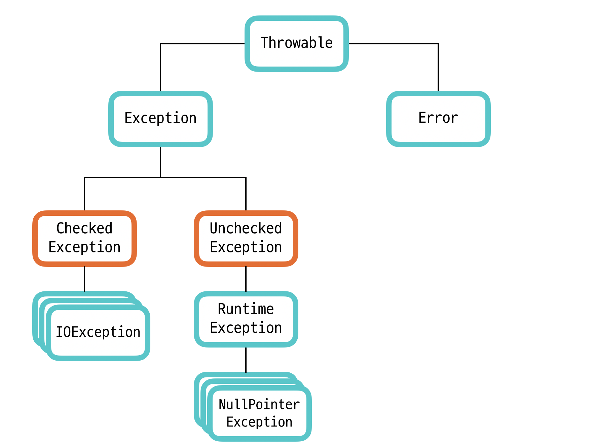

# 예외 처리하기

### Q. 자바의 예외 처리 구조를 이루는 주요 클래스를 설명하라.

### Q. '런타임 예외'와 '확인해야 하는 예외' 중 어느 것이 더 좋은가?

종종 이 책의 질문 그 자체가 이해가 안되는 경우가 있다. 이 질문 역시 그렇다. 아마 Checked exception과 Unchecked exception에 대한 비교질문으로 생각된다.

### Q. 연쇄 예외란 무엇인가?

### Q. try-with-resources 문은 무엇인가?